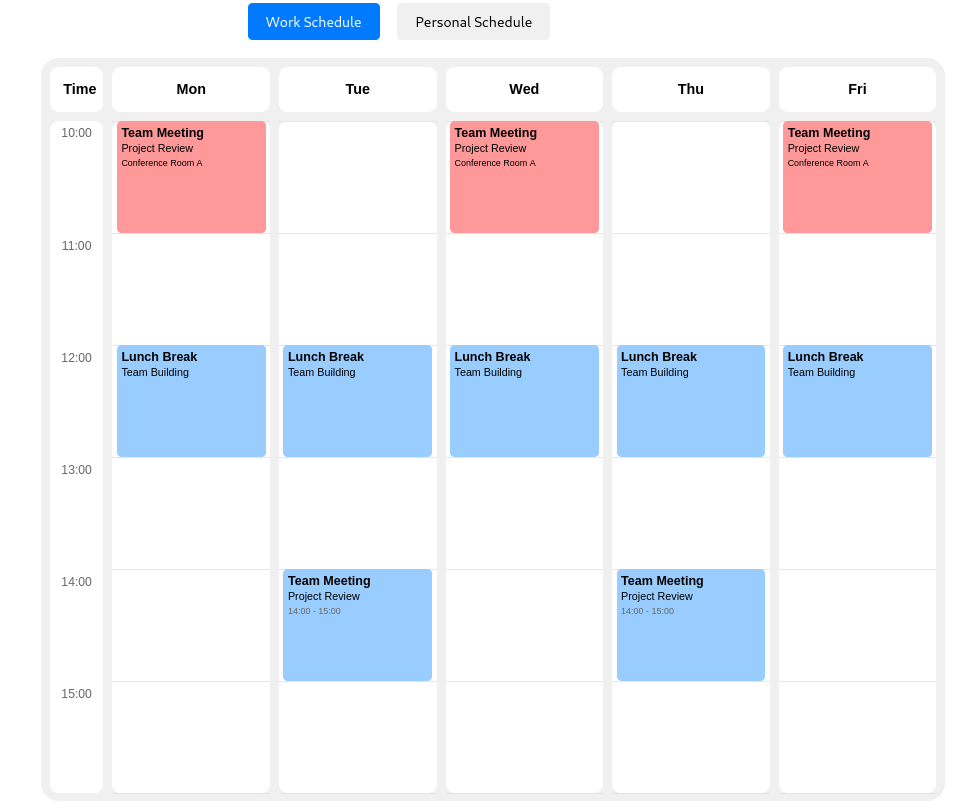

# Schedule Glance

A lightweight, customizable weekly schedule component for React applications. Schedule Glance provides an elegant way to display and manage weekly schedules with support for custom events, time slots, and interactive features.



## Features

- 📅 Weekly schedule view
- 🎨 Customizable event colors and styles
- 📱 Responsive design
- ⚡ Lightweight and performant
- 🔧 Highly configurable
- 💅 Custom event styling options
- 🎯 TypeScript support

## Installation

```bash
npm install @konnorkooi/schedule-glance
```

## Quick Start

```jsx
import { Schedule } from '@konnorkooi/schedule-glance';
import '@konnorkooi/schedule-glance/dist/index.css';

const events = [
  {
    id: "1",
    days: [0, 2, 4], // Monday, Wednesday, Friday
    start: "10:00",
    end: "11:00",
    color: "#ff9999",
    title: "Team Meeting",
    body: "Weekly Sync"
  }
];

function App() {
  return (
    <Schedule 
      events={events}
      width={800}
      height={600}
      onEventClick={(event) => console.log('Event clicked:', event)}
    />
  );
}
```

## Event Configuration

Events can be configured in three ways:

### 1. Basic Event
```jsx
const basicEvent = {
  id: "1",
  days: [1, 3], // Tuesday, Thursday
  start: "09:00",
  end: "10:00",
  color: "#99ff99"
};
```

### 2. Event with Title and Body
```jsx
const eventWithContent = {
  id: "2",
  days: [0, 2, 4],
  start: "14:00",
  end: "15:00",
  color: "#99ccff",
  title: "Team Meeting",
  body: "Project Review"
};
```

### 3. Event with Custom HTML Content
```jsx
const customEvent = {
  id: "3",
  days: [1],
  start: "11:00",
  end: "12:00",
  color: "#ff99ff",
  customContent: `
    <div style="padding: 5px;">
      <h3 style="margin: 0; font-size: 14px;">Custom Event</h3>
      <p style="margin: 2px 0; font-size: 12px;">With HTML content</p>
    </div>
  `
};
```

## Props

| Prop | Type | Required | Default | Description |
|------|------|----------|---------|-------------|
| events | ScheduleEvent[] | Yes | - | Array of events to display |
| width | number | No | 800 | Width of the schedule in pixels |
| height | number | No | 600 | Height of the schedule in pixels |
| onEventClick | (event: ScheduleEvent) => void | No | - | Callback when an event is clicked |
| headers | { label: string; dayIndex: number }[] | No | Mon-Fri | Custom headers for days |

## Types

```typescript
interface ScheduleEvent {
  id: string;
  days: number[];        // Array of day indices (0-6, where 0 is Monday)
  start: string;         // Time in "HH:MM" format
  end: string;          // Time in "HH:MM" format
  color?: string;       // Optional background color
  customContent?: string; // Optional custom HTML content
  title?: string;       // Optional event title
  body?: string;        // Optional event body
  [key: string]: any;   // Additional custom properties
}

interface ScheduleProps {
  events: ScheduleEvent[];
  width?: number;
  height?: number;
  onEventClick?: (event: ScheduleEvent) => void;
  headers?: { label: string; dayIndex: number }[];
}
```

## Custom Headers

You can customize the day headers:

```jsx
const customHeaders = [
  { label: "Mon", dayIndex: 0 },
  { label: "Tue", dayIndex: 1 },
  { label: "Wed", dayIndex: 2 },
  { label: "Thu", dayIndex: 3 },
  { label: "Fri", dayIndex: 4 }
];

<Schedule 
  events={events}
  headers={customHeaders}
/>
```

## Styling

The component comes with default styles, but you can override them using CSS classes:

```css
.schedule-event {
  /* Custom event styles */
}

.event-title {
  /* Custom title styles */
}

.event-content {
  /* Custom content styles */
}
```

## Examples

### Multiple Events
```jsx
const events = [
  {
    id: "1",
    days: [1, 3],
    start: "09:00",
    end: "10:00",
    color: "#99ff99",
    title: "Morning Meeting",
    body: "Daily Standup"
  },
  {
    id: "2",
    days: [0, 2, 4],
    start: "14:00",
    end: "15:00",
    color: "#99ccff",
    title: "Team Sync",
    body: "Weekly Review"
  }
];

<Schedule events={events} />
```

### Event Click Handler
```jsx
const handleEventClick = (event) => {
  console.log('Event clicked:', event);
  // Handle event click
};

<Schedule 
  events={events}
  onEventClick={handleEventClick}
/>
```

## Contributing

Contributions are welcome! Please feel free to submit a Pull Request.

1. Fork the repository
2. Create your feature branch (`git checkout -b feature/AmazingFeature`)
3. Commit your changes (`git commit -m 'Add some AmazingFeature'`)
4. Push to the branch (`git push origin feature/AmazingFeature`)
5. Open a Pull Request

## License

This project is licensed under the MIT License 

## Author

Konnor Kooi

## Support

If you have any questions or run into issues, please open an issue on the [GitHub repository](https://github.com/cwooper/schedule-glance/issues).

## TODO

-   [x] Create Schedule Object
    -   [x] Add Times Column
    -   [x] Add Descending times (08:00 - 17:00)
    -   [x] Add Header Row with days
-   [x] Create Events Object
    -   [x] Rendered with Days and Times
    -   [x] Ability to customize the color
-   [x] Render Events in the Schedule
-   [x] Add Event Pop-ups upon click
-   [x] Allow for modular event sizing (height)
-   [x] Make Schedule Events more modular.
    -   [x] Remove All internal "decorative elements" (to be replaced with HTML),
            while keeping "Days" and "Times."
    -   [x] Add integrated HTML elements for extended customizability.
    -   [x] Show demo with the same Subject/Title/etc. but with HTML.
-   [x] Make Schedule Headers more modular.
    -   [x] Allow user to input different headers when creating the schedule.
    -   [x] Rework "Days" to be assigned to a numbered column (0 for day 0/Mon)
-   [ ] Change columns to be uniform width based on percentage of total width.
-   [x] Add time lines to the rows
        (thin lines representing the hour marks, behind the events).
-   [x] Change the start and end time of the schedule to act modulary based upon
        added events (based on earliest event and latest event).
-   [ ] Allow the developer using the schedule module to import an array of events.
-   [ ] Add a "Clear Schedule" option to easily cycle through schedules.
-   [ ] Make nicer looking poppups. I know this is using the custom components
        right now, maye add if there is to much info add elipses (...) for the calendar event
