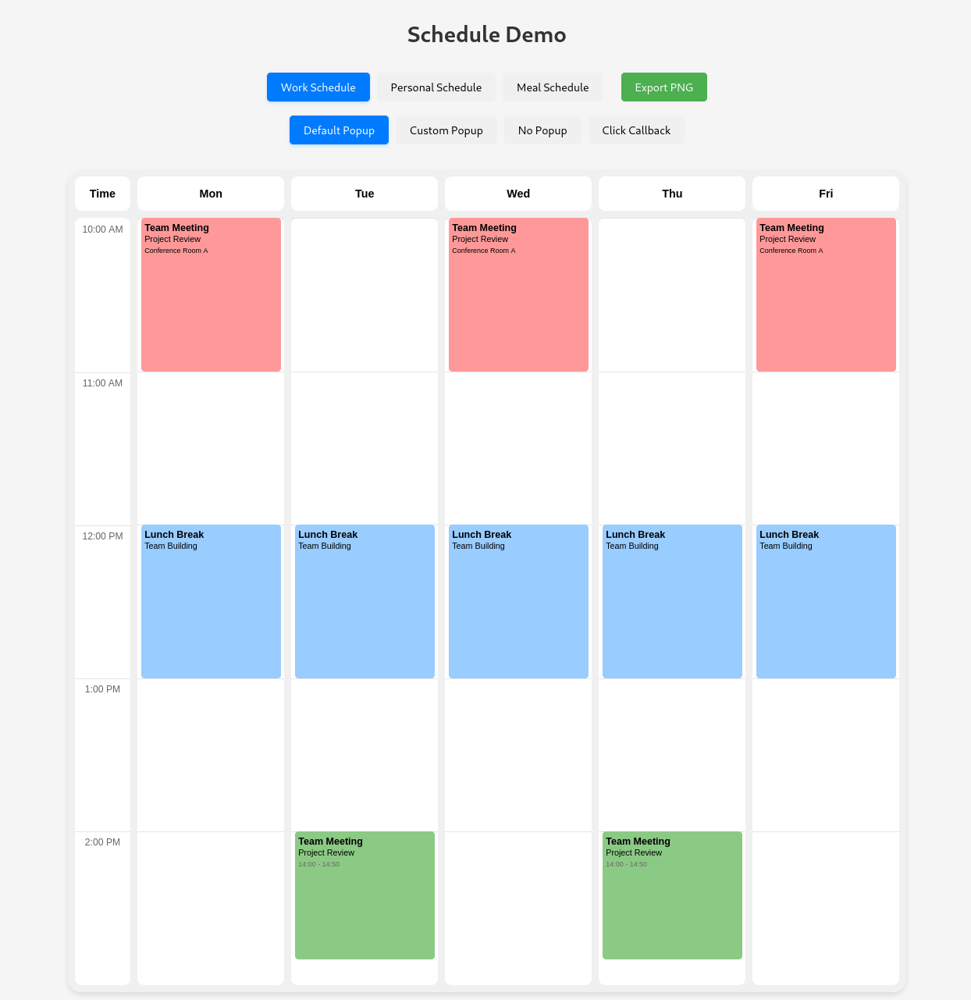

# Schedule Glance

A lightweight, customizable weekly schedule component for React applications. Schedule Glance provides an elegant way to display and manage weekly schedules with support for custom events, time slots, and interactive features.



## Features

- 📅 Weekly schedule view
- 🎨 Customizable event colors and styles
- 📱 Responsive design
- ⚡ Lightweight and performant
- 🔧 Highly configurable
- 💅 Custom event styling options
- 🎯 TypeScript support
- 📤 Export to PNG functionality
- 🎈 Customizable empty state message

## Installation

```bash
npm install schedule-glance
```

## Container Requirements

The Schedule component is designed to fill its container. To work properly, the container must have:

1. `position: relative`
2. A defined height

### Common Container Patterns

1. **Fixed Height:**
```jsx
<div style={{ position: 'relative', height: '600px' }}>
  <Schedule events={events} />
</div>
```

2. **Flexbox Container (Recommended):**
```jsx
<div style={{ display: 'flex', flexDirection: 'column', height: '100vh' }}>
  <header>Header Content</header>
  <main style={{ position: 'relative', flex: 1 }}>
    <Schedule events={events} />
  </main>
  <footer>Footer Content</footer>
</div>
```

3. **Grid Container:**
```jsx
<div style={{ display: 'grid', gridTemplateRows: 'auto 1fr auto', height: '100vh' }}>
  <header>Header Content</header>
  <main style={{ position: 'relative' }}>
    <Schedule events={events} />
  </main>
  <footer>Footer Content</footer>
</div>
```

## Props

| Prop | Type | Required | Default | Description |
|------|------|----------|---------|-------------|
| events | ScheduleEvent[] | Yes | - | Array of events to display |
| onEventClick | (event: ScheduleEvent) => void | No | - | Callback when an event is clicked |
| headers | { label: string; dayIndex: number }[] | No | Mon-Fri | Custom headers for days |
| customPopupHandler | (event: ScheduleEvent) => void | No | - | Custom popup handler |
| useDefaultPopup | boolean | No | true | Whether to use the default popup |
| emptyStateMessage | string | No | "No events scheduled" | Message shown when no events are present |

## Types

```typescript
interface ScheduleEvent {
  id: string;
  days: number[];        // Array of day indices (0-6, where 0 is Monday)
  start: string;         // Time in "HH:MM" format
  end: string;          // Time in "HH:MM" format
  color?: string;       // Optional background color
  customContent?: string; // Optional custom HTML content
  title?: string;       // Optional event title
  body?: string;        // Optional event body
  [key: string]: any;   // Additional custom properties
}

interface ScheduleProps {
  events: ScheduleEvent[];
  onEventClick?: (event: ScheduleEvent) => void;
  headers?: { label: string; dayIndex: number }[];
  customPopupHandler?: (event: ScheduleEvent) => void;
  useDefaultPopup?: boolean;
  emptyStateMessage?: string;
}

interface ScheduleRef {
  exportToPng: (filename?: string) => Promise<void>;
}
```

## Basic Usage

```jsx
import { Schedule } from 'schedule-glance';

const MySchedule = () => {
  const events = [
    {
      id: "1",
      days: [1, 3], // Tuesday and Thursday
      start: "09:00",
      end: "10:00",
      color: "#99ff99",
      title: "Morning Meeting",
      body: "Daily Standup"
    }
  ];

  return (
    <div style={{ position: 'relative', height: '600px' }}>
      <Schedule events={events} />
    </div>
  );
};
```

## Custom Headers

You can customize the day headers:

```jsx
const customHeaders = [
  { label: "Mon", dayIndex: 0 },
  { label: "Tue", dayIndex: 1 },
  { label: "Wed", dayIndex: 2 },
  { label: "Thu", dayIndex: 3 },
  { label: "Fri", dayIndex: 4 }
];

<Schedule 
  events={events}
  headers={customHeaders}
/>
```

## Styling

The component comes with default styles, but you can override them using CSS classes:

```css
.schedule-event {
  /* Custom event styles */
}

.event-title {
  /* Custom title styles */
}

.event-content {
  /* Custom content styles */
}
```

## Advanced Examples

### Multiple Events with Custom Content

```jsx
const events = [
  {
    id: "1",
    days: [1, 3],
    start: "09:00",
    end: "10:00",
    color: "#99ff99",
    customContent: `
      <div style="padding: 5px;">
        <h3 style="margin: 0; font-size: 14px;">Team Meeting</h3>
        <p style="margin: 2px 0; font-size: 12px;">Project Review</p>
      </div>
    `
  },
  {
    id: "2",
    days: [0, 2, 4],
    start: "14:00",
    end: "15:00",
    color: "#99ccff",
    title: "Team Sync",
    body: "Weekly Review"
  }
];

<Schedule events={events} />
```

### Custom Event Handling

```jsx
const handleEventClick = (event) => {
  console.log('Event clicked:', event);
  // Handle event click
};

<Schedule 
  events={events}
  onEventClick={handleEventClick}
  useDefaultPopup={false} // Disable default popup if using custom handler
/>
```

### Export to PNG

```jsx
import { useRef } from 'react';
import { Schedule, ScheduleRef } from 'schedule-glance';

const MySchedule = () => {
  const scheduleRef = useRef<ScheduleRef>(null);

  const handleExport = async () => {
    try {
      await scheduleRef.current?.exportToPng('my-schedule.png');
    } catch (error) {
      console.error('Failed to export:', error);
    }
  };

  return (
    <div>
      <button onClick={handleExport}>Export Schedule</button>
      <div style={{ position: 'relative', height: '600px' }}>
        <Schedule ref={scheduleRef} events={events} />
      </div>
    </div>
  );
};
```

## Contributing

Contributions are welcome! Please feel free to submit a Pull Request.

1. Fork the repository
2. Create your feature branch (`git checkout -b feature/AmazingFeature`)
3. Commit your changes (`git commit -m 'Add some AmazingFeature'`)
4. Push to the branch (`git push origin feature/AmazingFeature`)
5. Open a Pull Request

## License

This project is licensed under the MIT License. See the [LICENSE](./LICENSE) file for details.

## Author

Konnor Kooi

## Support

If you have any questions or run into issues, please open an issue on the [GitHub repository](https://github.com/cwooper/schedule-glance/issues).